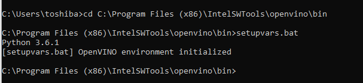
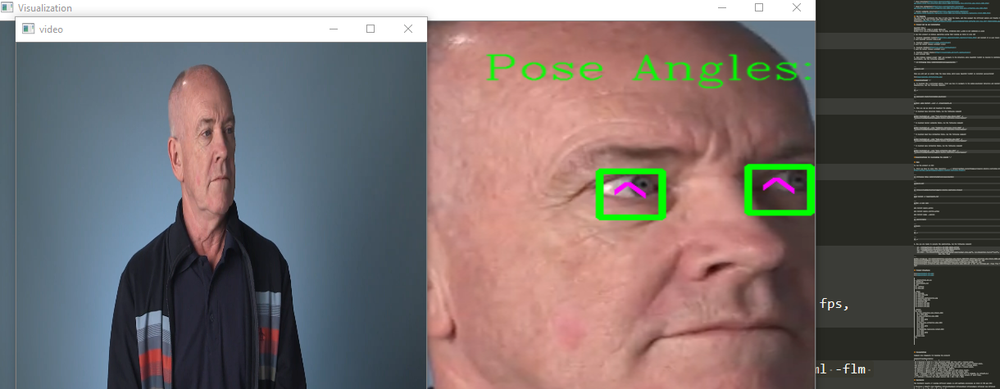
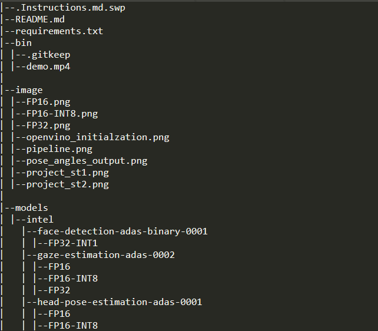
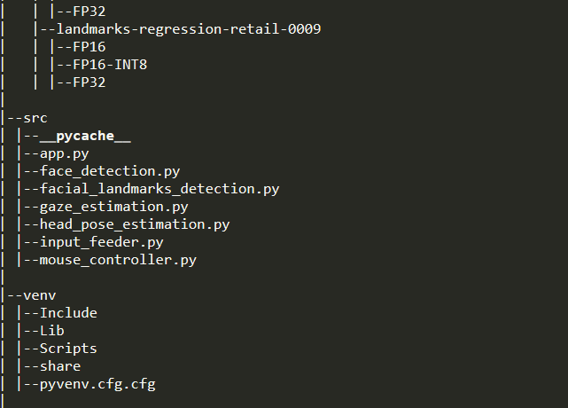
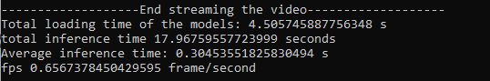
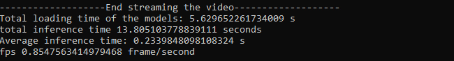

# Computer Pointer Controller

In this project, you will use a gaze detection model to control the mouse pointer of your computer. You will be using the Gaze Estimation model to estimate the gaze of the user's eyes and change the mouse pointer position accordingly. This project will demonstrate your ability to run multiple models in the same machine and coordinate the flow of data between those models.

## How it works
You will be using the InferenceEngine API from Intel's OpenVino ToolKit to build the project. The [gaze estimation](https://docs.openvinotoolkit.org/latest/omz_models_intel_gaze_estimation_adas_0002_description_gaze_estimation_adas_0002.html) model requires three inputs:

The head pose
The left eye image
The right eye image.
To get these inputs, you will have to use three other OpenVino models:

* [Face Detection](https://docs.openvinotoolkit.org/latest/omz_models_intel_face_detection_adas_binary_0001_description_face_detection_adas_binary_0001.html)

* [Head Pose Estimation](https://docs.openvinotoolkit.org/latest/omz_models_intel_head_pose_estimation_adas_0001_description_head_pose_estimation_adas_0001.html)

* [Facial Landmarks Detection](https://docs.openvinotoolkit.org/latest/omz_models_intel_landmarks_regression_retail_0009_description_landmarks_regression_retail_0009.html)

## The Pipeline
You will have to coordinate the flow of data from the input, and then amongst the different models and finally to the mouse controller. The flow of data will look like this:


## Project Set Up and Installation


I run this project on Windows10 Pro operating system that running on Intel i3 core CUP

1- Download [OpenVINO ToolKit](https://docs.openvinotoolkit.org/latest/index.html) and install it on your local machine.
I used the latest release version of OpenVINO : 2020.4.287 

2- Download [Cmake](https://cmake.org/download/)
I used the latest release version of Cmake: 3.18.0

3- Download [Python](https://www.python.org/downloads/)
I used Python version: 3.6.1

4- Download [Visual Studio](https://visualstudio.microsoft.com/downloads/)
I used Visual Studio version: 2019

5- Open Windows command prompt `cmd` and navigate to the directory where OpenVINO ToolKit is located to initilize openvino environment, run the following command:

```
 cd C:\Program Files (x86)\IntelSWTools\openvino\bin 
``` 

and run the following command:

```
setupvars.bat
```

then you will get an output like the image below which means OpenVINO ToolKit is installed successfully!

 

##Congratulations! *_*


6- To download the 4 pretrained models, first you have to navigate to the model_downloader directory and install the tools' dependencies, run the following commands:

```
cd ..
```

```
cd deployment_tools\tools\model_downloader
```

```
python3 -mpip install --user -r ./requirements.in
```

7- Then you can go ahead and download the models ----->

* To download Face Detection Model, run the following command:

```
python downloader.py --name "face-detection-adas-binary-0001" -o "C:\Users\toshiba\Desktop\Computer_Pointer_Controller_Project\models"
```

* To download Facial Landmarks Model, run the following command:

```
python downloader.py --name "landmarks-regression-retail-0009" -o "C:\Users\toshiba\Desktop\Computer_Pointer_Controller_Project\models"
```

* To download Head Pose Estimation Model, run the following command:

```
python downloader.py --name "head-pose-estimation-adas-0001" -o "C:\Users\toshiba\Desktop\Computer_Pointer_Controller_Project\models"
```

* To download Gaze Estimation Model, run the following command:

```
python downloader.py --name "gaze-estimation-adas-0002" -o "C:\Users\toshiba\Desktop\Computer_Pointer_Controller_Project\models"
```

##Congratulations for downloading the models! *_*


## Demo

To run the project on CPU:

1- First you have to clone this repository -----> [https://github.com/kalthommusa/Computer_Pointer_Controller_Project.git](https://github.com/kalthommusa/Computer_Pointer_Controller_Project) 

2- Then open the command prompt `cmd` and run the following commands:

```
cd C:\Program Files (x86)\IntelSWTools\openvino\bin\
```

```
setupvars.bat 
```

```
cd C:\Users\toshiba\Desktop\Computer_Pointer_Controller_Project
```

```
pip3 install -r requirements.txt
```

```
python -m venv venv
```

```
pip install opencv-python
```

```
pip install numpy --upgrade
```


```
cd venv/Scripts/
```

```
activate
```

```
cd ..
```

```
cd ..
```

3- Now you are ready to execute the application, run the following command:



```
python src\app.py -fcm models\intel\face-detection-adas-binary-0001\FP32-INT1\face-detection-adas-binary-0001.xml -flm models\intel\landmarks-regression-retail-0009\FP16\landmarks-regression-retail-0009.xml -hpm models\intel\head-pose-estimation-adas-0001\FP16\head-pose-estimation-adas-0001.xml -gzm models\intel\gaze-estimation-adas-0002\FP16\gaze-estimation-adas-0002.xml -d CPU -inv bin\demo.mp4 -flags ffcm fflm fhpm fgzm
```


## Project Structure:




|
|--.Instructions.md.swp
|--README.md
|--requirements.txt
|--bin
| |--.gitkeep
| |--demo.mp4
|
|--image
| |--FP16.png
| |--FP16-INT8.png
| |--FP32.png
| |--openvino_initialzation.png
| |--pipeline.png
| |--pose_angles_output.png
| |--project_st1.png
| |--project_st2.png
|
|--models
| |--intel
|   |--face-detection-adas-binary-0001
|   | |--FP32-INT1
|   |--gaze-estimation-adas-0002
|   | |--FP16
|   | |--FP16-INT8
|   | |--FP32
|   |--head-pose-estimation-adas-0001
|   | |--FP16
|   | |--FP16-INT8
|   | |--FP32
|   |--landmarks-regression-retail-0009
|   | |--FP16
|   | |--FP16-INT8
|   | |--FP32
|
|--src
| |--__pycache__
| |--app.py
| |--face_detection.py
| |--facial_landmarks_detection.py
| |--gaze_estimation.py
| |--head_pose_estimation.py
| |--input_feeder.py
| |--mouse_controller.py
|
|--venv
| |--Include
| |--Lib
| |--Scripts
| |--share
| |--pyvenv.cfg.cfg
| 


## Documentation

Command Line Arguments for Running the project:

Argument|Type|Description
| ------------- | ------------- | -------------
-fcm | Required | Path to .xml file of Face Detection model.
-flm | Required | Path to .xml file of Facial Landmark Detection model.
-hpm| Required | Path to .xml file of Head Pose Estimation model.
-gzm| Required | Path to .xml file of Gaze Estimation model.
-inv| Required | Path to video file or enter cam for webcam.
-l| Optional | Absolute path to a shared library with the kernels impl.
-prod  | Optional | Specify confidence threshold which the value here in range(0, 1), default=0.6
-d | Optional | Provide the target device: CPU / GPU / VPU / FPGA
-flags  | Optional | for see the visualization of different model outputs of each frame.


## Benchmarks

I ran the benchmarks test on my Toshiba laptop with: Intel Core i3 
The Benchmark performance were run on different models precisions (all models except the Face Detection model were available in three precisions: FP32, FP16, INT8)

The results were as shown in the images below ----->

* FP16 :


* FP16-INT8 :


* FP32 :


## Results


The FP16 gives us the best model loading time compared with the FP32-INT8 and FP32 models, while the FP32-INT8 shows the best inference time comapred with the FP16 and FP32 models. 
